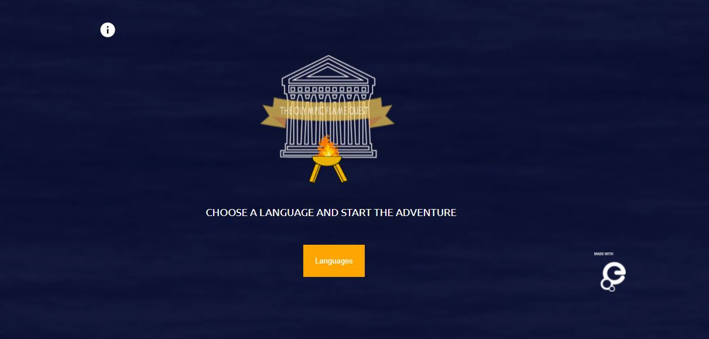

# The Olympic Flame Quest
## Overview

 

The Olympic Flame Quest is a web game addressed to children between 8 and 12 year-old to learn about Olympic values with digital heritage items from Europeana Collections. 

It is based on a map where the player goes around six different cities of Ancient Greece getting the Olympic Flame back to Olympia learning during this journey about ancient history, culture and the history of Olympism.

The game is a friendly way of learning and a powerful tool to develop new skills and work on the Olumpic values such as: the joy of effort in sport, respect for the others, fair play, friendship, the pursuit of excellence and the balance between body, will and mind.

 

[Try the demo version: https://raulgomhern.github.io/olympicflamequest/assets/html/index.html](https://raulgomhern.github.io/olympicflamequest/assets/html/index.html)

## Technologies used

* HTML5
* CSS3
* JavaScript (ES6)
* JQuery 3.5

## Technical characteristics

- Version: 1.0
- Font: Ubuntu
- Content provided by: European cultural institutions & Europeana aggregators.
- Content taken from: [Europeana Collections](https://europeana.eu)
- Type of content: Original and reused video, audio and images from several institutions
- Responsiveness: Screens and tablet in landscape orientation. 
   - Default device: Tablet 6 inch or similar, min-width: 800px
   - Ipad, similars & above, min-width: 1024px
   - Laptops, screens 15-19 inch & above, min-width: 1224px
   - Screens, Desktops 19 inch & above, min-width: 1600px

## Next steps for version 1.1

* Implementation of Europeana media player for the videos
* Europeana API Rest connection for the sources.
* Multilingual functionality available (rules, instructions and subtitles)
* Responsiveness improvement

## License

- **CC-BY-SA 4.0.** Read the [License.md](License.md) file to know the specifications about it.

## Acknowledgment

Thanks to all the staff from the Europeana Foundation for helping me to create this educational resource in the framework of the [Europeana Sport Campaign](https://pro.europeana.eu/page/europeana-sport) in the processes of script checking, voice recording, code checking, time planning and dissemination of the project.

Thanks to the following cultural institutions and Europeana aggregators for the content provided and the permission given to make possible the current educational resource:

* CNRS-LARHRA
* Music Library of Greece of The Friends of Music Society
* University of Bologna
* Hellenic Literary and Historical Archive (ELIA) - National Bank Educational Foundation (MIET).
* The Archaeological Society at Athens
* Hellenic Olympic Committee
* Museum of Modern Olympic Games
* American School of Classical Studies at Athens
* Arbejdermuseet & ABA
* Stadtgeschichtliches Museum Leipzig
* Deutsche Fotothek
* Sportimonium vzw
* Netherlands Institute for Sound and Vision
* EUscreen
* TV3 Televisió de Catalunya (TVC)
* National Library of Scotland
* EFG - The European Film Gateway
